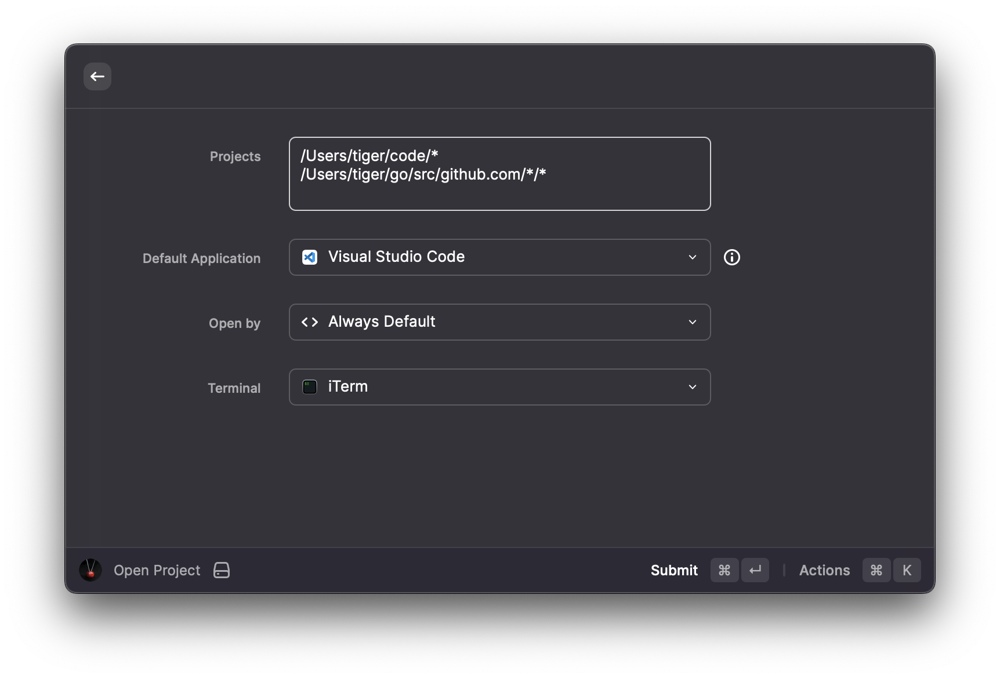
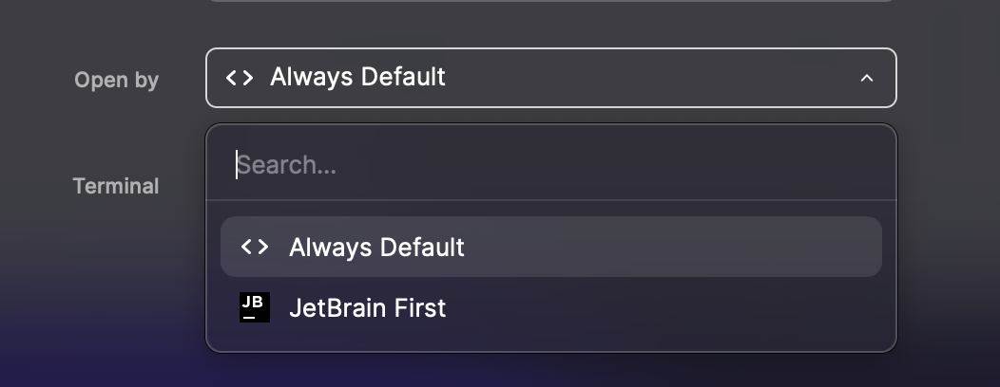

# Open Project

open your projects in different way
## How to use

## Requirements
*  If you are going to use this extension to open any jetbrain applications, make sure you can open them using the command line at first. 
## Config

1. Projects: the path of your projects

this extension will use `ls -drt $path` to find your projects, so you can use the '*' wildcard or any of the wildcards supported by `ls`.

2. Default Application

Default Application to open your project.

3. Open by

* Always Default: open your project by default application
* jetbrain: try to identify the language of the project and open it with the corresponding application

4. Terminal

terminal application for your projects, support:
* terminal
* item
* warp 